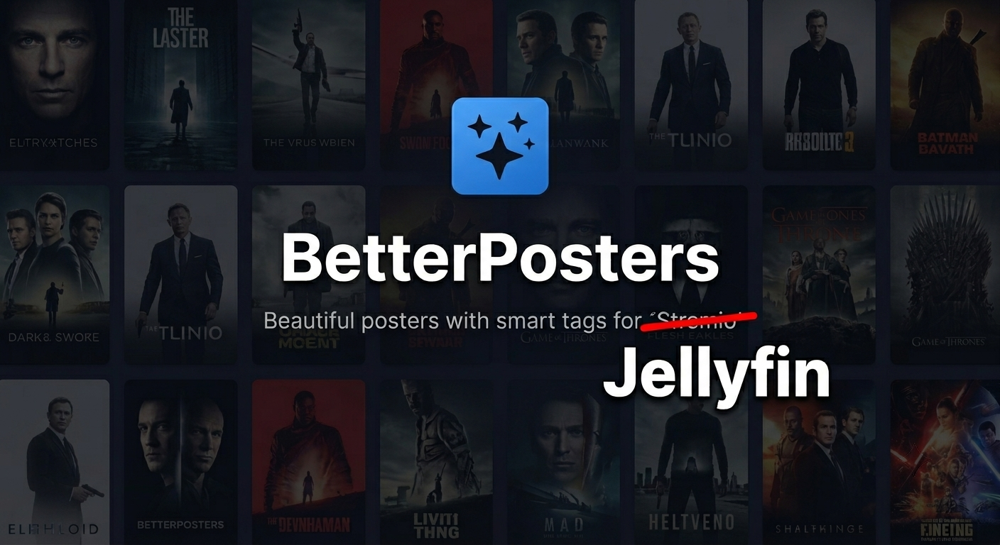

# Better Poster — Minimal (Jellyfin)



A focused remote-image provider for [Jellyfin](https://jellyfin.org) that surfaces **[btttr.cc](https://btttr.cc)** posters as the primary image for Movies, TV Series, and TV Seasons. IMDb‑first with an optional TMDB fallback, configurable overlay set, 18 languages, a scheduled refresh task, and a built‑in preview button — no API keys, no Trakt, no scraping, no telemetry.

* **Version:** 1.0.4.0
* **Target Jellyfin:** 10.11.x
* **Runtime:** .NET 9.0
* **GUID:** `c2f3aaf3-f591-4a4f-b7e2-a4f1bc9c7d1e`

---

## Table of contents

1. [What it does](#what-it-does)
2. [What it doesn't do](#what-it-doesnt-do)
3. [How btttr.cc works](#how-bttrcc-works)
4. [Requirements](#requirements)
5. [Installation](#installation)
6. [Configuration](#configuration)
7. [Scheduled refresh](#scheduled-refresh)
8. [Per‑item usage](#per-item-usage)
9. [Troubleshooting](#troubleshooting)
10. [Build and release (maintainers)](#build-and-release-maintainers)
11. [Repo layout](#repo-layout)
12. [Credits and license](#credits-and-license)

---

## What it does

* Registers btttr.cc as an **Official Remote Image Provider** for items Jellyfin doesn't already have a primary image for.
* **Items covered:** Movies, TV Series, **and** per‑season posters (see [Per‑season posters](#per-season-posters) below).
* **Identifier resolution:** IMDb ID first; if missing **and** the TMDB fallback toggle is on, the TMDB ID is used instead.
* **Overlay toggles** picked by the user, layered onto the upstream poster:
  * **Trend tags** — "Trending", "New", "IMDb Top 3" stickers.
  * **Quality tags** — 4K / Dolby Vision / Atmos badges.
  * **Genre strip.**
  * **Rating strip** with a choice of **rating source** (Average, IMDb, TMDB, Rotten Tomatoes, Metacritic, Letterboxd, Roger Ebert).
  * **Age rating** chip (PG‑13 / TV‑MA / R / etc.).
* **18 languages** for overlays (English is the implicit default).
* **Scheduled refresh task** (default every 24 h) so newly added items get a poster on their own without a manual library rescan.
* **Telemetry‑free status indicator** — "last successful fetch" timestamp persisted locally by Jellyfin's own configuration XML serializer. Nothing ever leaves the user's server.

## What it doesn't do

This is the **minimal**, focused fork of the parent BetterPoster plugin. To keep the surface small and the code auditable, the following are intentionally absent:

* No Trakt token or watched‑progress integration.
* No TVDB / AniList / custom metadata sources besides IMDb and TMDB.
* No self‑hosted URL override — the upstream is always the public btttr.cc.
* No per‑item UI override on a movie detail page — library‑level config is the only surface.
* No client‑side caching layer — Jellyfin's image provider pipeline handles caching.

## How btttr.cc works

*Live-render design by [btttr.cc](https://btttr.cc) — there is no formal status page; check the [Issue tracker](https://github.com/CodeSieb/Jellyfin-Better-Posters/issues) when posters start 404ing across the library.*

A btttr.cc URL is a *live render*, not a static file. When the plugin (or the **Preview Poster** button) fetches `https://btttr.cc/poster/imdb/poster-default/tt0111161.jpg` with the query string your toggles compose, btttr.cc's server reads the IMDb / TMDB entry, picks the poster + backdrop + rating / genre / age-rating / trending metadata, **composes those overlays at render time**, and returns a single 500×750 JPEG.

That is why **Preview Poster** is meaningful even when the poster already looks right in your library: every toggle reshapes what the server composites on the next fetch. Flipping **Trend Tags** off in the settings page and clicking Preview returns a visibly different image — the rating strip, genre label, and quality chips all re-render with the new selection. The poster is never "cached on disk on btttr.cc's side" in a way you can request by variant name; the URL is the variant.

### URL scheme

A btttr.cc URL has two parts: a path that encodes which overlays btttr.cc composites onto the poster, and an optional query string that suppresses trend tags, picks the overlay language, and picks the rating source. The path rule is:

| Genre | Rating | Quality | Age | Path becomes |
|-------|--------|---------|-----|--------------|
| on    | on or off | on  | on  | `poster-gqa` |
| on    | off    | off     | off | `poster-g`   |
| off   | on     | off     | off | `poster-r`   |
| on    | off    | on      | off | `poster-gq`  |
| off   | on     | on      | off | `poster-rq`  |
| on    | on     | off     | on  | `poster-ga`  |
| off   | off    | off     | off | `poster-n`   |
| off   | off    | on      | off | `poster-nq`  |
| off   | off    | off     | on  | `poster-na`  |

In short: the path always carries at least one of `g` (Genre overlay), `r` (Rating overlay), or `n` (neither). **Genre wins over Rating** — when Genre is on, the rating is rendered inside the same genre strip, so we omit `r`. Then `+q` if Quality tags is on, `+a` if Age rating is on.

The query string has three optional parts joined with `&`:

* `tag=none` — added only when **Trend Tags** is off (suppresses Trending / New / IMDb Top 3 stickers).
* `lang=xx` — added when **Language** is not English (e.g. `lang=es`, `lang=fr`, `lang=zh`).
* `rs=xx` — added when **Rating Source** is not "Average" (`IM` for IMDb, `TM` for TMDB, `RT` for Rotten Tomatoes, `MC` for Metacritic, `LB` for Letterboxd, `RE` for Roger Ebert).

All seven user-facing example URLs in the settings page's *URL Patterns Reference* panel were verified against btttr.cc on 2026‑06‑24 to return HTTP 200 for `tt0111161` (Shawshank Redemption). The plugin also ships a regression probe under `probe/` (`cd probe && dotnet run -c Release` — exit 0 = all match) that re-asserts every example against the actual compiled `BtttrPosterUrlBuilder` on every release bump.

## Requirements

* **Jellyfin server:** 10.11.x or newer with the matching plugin ABI (`10.11.0.0`).
* **Outbound HTTPS** from the Jellyfin host to `btttr.cc` (TCP 443).
* **Provider IDs:** items that carry an IMDb ID are surfaced automatically; items that only carry a TMDB ID are surfaced when **Fallback to TMDB** is on.

## Installation

### Recommended: install from the Jellyfin catalog

1. Dashboard → **Plugins** → **Repositories** → **+**.
2. Paste this repository URL:

   ```
   https://raw.githubusercontent.com/CodeSieb/Jellyfin-Better-Posters/main/manifest.json
   ```

3. Back in **Catalog** → **Metadata** → **Better Poster Minimal** → **Install**.
4. **Restart Jellyfin.**

### Alternative: manual install

1. Grab the latest zip from the `releases/` folder of this repo.
2. Drop it into `<JELLYFIN_DATA>/plugins/BetterPosterMinimal/` (create the folder if it doesn't exist).
3. **Restart Jellyfin.**

## Configuration

Open **Dashboard → Plugins → Better Poster Minimal**.

### Poster options

| Toggle | Default | What it controls |
|---|---|---|
| **Trend Tags** | on | Trending / New / IMDb Top 3 stickers |
| **Quality Tags** | off | 4K / Dolby Vision / Atmos badges |
| **Genre** | on | Genre label strip across the bottom |
| **Rating** | on | Numeric rating strip across the bottom |
| **Rating Source** | Average | Source for that numeric rating (Average of enabled sources, IMDb, TMDB, Rotten Tomatoes, Metacritic, Letterboxd, Roger Ebert) |
| **Age Rating** | off | PG‑13 / TV‑MA / R chip |
| **Language** | English | Overlay language (18 options) |

### Item types

* **Enable for Movies** *(default on)* — surface btttr.cc posters for Movie items.
* **Enable for Series** *(default on)* — surface btttr.cc posters for TV Series.
* **Enable for Season posters** *(default on)* — use the parent series' IMDb ID + the season index (`tt1234567:season:N.jpg`) so each season gets its own poster. See [Per‑season posters](#per-season-posters) below.
* **Fallback to TMDB when IMDb is missing** *(default on)* — useful for series that only carry a TMDB ID.

### Status

* **Last successful fetch** — local timestamp updated any time:
  * A user‑initiated "Preview" returns 2xx.
  * A library scan successfully resolves a btttr.cc primary image.
  * The scheduled refresh task completes with at least one item succeeded.

  Rendered as "Last successful fetch: `<local time>` (`N minutes/hours/days ago`)" or "never".

### Preview

A **Test IMDb ID** field (defaulting to *tt0111161* — The Shawshank Redemption) + a **Preview Poster** button renders the actual btttr.cc URL inline using the current toggle combination. Adjust toggles, click Preview, and the rendered image reflects your settings — no need to open a real Movie to see what you're going to get.

### Actions

* **Save** — persists your toggle override.
* **Reset to Defaults** — returns every toggle to its shipped default.

## Scheduled refresh

A task called **Better Poster - Refresh Posters** (in the *Better Poster* category) is registered automatically when the plugin installs. Default cadence: **every 24 hours**. Change the cadence from **Dashboard → Scheduled Tasks → Better Poster → Better Poster - Refresh Posters**.

On each run the task walks every Movie / Series / Season matching the enabled item‑type toggles and asks Jellyfin's image provider pipeline to re‑resolve the primary image. The "Last successful fetch" timestamp is bumped whenever at least one item succeeds.

## Per‑item usage

Once installed, no special workflow is required — btttr.cc posters show up in the standard place:

* **Movie detail → ⋮ menu → Edit Images → Search** lists the upstream poster alongside any local image.
* Same flow for **TV Series**.
* Same flow per‑**Season** when **Enable for Season posters** is on.

The provider returns a single 500×750 JPEG per item. Whatever Jellyfin ends up selecting as the "primary" on the Edit Images sheet is the one that ships.

### Per‑season posters

Seasons rarely carry their own provider IDs. The provider therefore:

1. Reads the IMDb ID off `season.Series` (the parent Series).
2. Reads `season.IndexNumber` (the 1‑based season number; specials use 0 and are skipped).
3. Constructs the URL with a literal `:season:<N>` suffix because btttr.cc's path matcher expects the structure `<imdb>:season:<n>.jpg` rather than the percent‑escaped `%3Aseason%3A<n>` form.

This means the very first time a season is shown in Edit Images after upgrading, Jellyfin re‑queries btttr.cc and the URL `https://btttr.cc/poster/.../poster-default/<imdb>:season:<N>.jpg` resolves to a season‑specific render.

## Troubleshooting

* **Catalog install shows the plugin but "Install" fails with a checksum mismatch.** The MD5 in `manifest.json > versions[0].checksum` has drifted from the actual `releases/*.zip`. Maintainers: regenerate with `python build_plugin_zip.py` and paste the new UPPERCASE MD5 back into the manifest.
* **The provider isn't appearing on a Movie's "Search" sheet.**
  1. Confirm **Enable for Movies** is on in the plugin settings.
  2. Confirm the Movie has an IMDb ID (or a TMDB ID + **Fallback to TMDB** enabled).
  3. Open **Dashboard → Logs** and filter on `Better Poster` to see what the provider returned.
* **Posters are 404 when Jellyfin tries to fetch them.** Run the **Preview Poster** button with the default IMDb ID. If the preview itself 404s, your Jellyfin host can't reach `btttr.cc` — check outbound HTTPS / DNS / corporate proxy.
* **"Last successful fetch: never" persists even after Refresh Posters runs.** The timestamp is only bumped when *at least one* item succeeds. If every item returned empty (no ID, no fallback match) or the refresh task was killed mid‑run, the timestamp stays at "never". Opening a single Movie → Edit Images → Search will trigger the success path independently.
* **Toggle changes don't seem to take effect.** Jellyfin caches the resolution per item. After a toggle change, hit **Edit Images → Search** again on a single item, or wait for the next scheduled refresh.

## Build and release (maintainers)

```bash
# 1. Build the DLL
dotnet build -c Release
# → bin/Release/net9.0/Jellyfin.Plugin.BetterPosterMinimal.dll

# 2. Pack the zip (deterministic)
python build_plugin_zip.py
# → releases/Jellyfin.Plugin.BetterPosterMinimal-1.0.0.0.zip
# → releases/Jellyfin.Plugin.BetterPosterMinimal-1.0.0.0.zip.md5   (lowercase hex)

# 3. (Windows equivalent of step 2's MD5 line)
certutil -hashfile releases\Jellyfin.Plugin.BetterPosterMinimal-1.0.0.0.zip MD5
# On *nix:
md5sum releases/Jellyfin.Plugin.BetterPosterMinimal-1.0.0.0.zip

# 4. Paste the UPPERCASE MD5 into manifest.json > versions[0].checksum
#    and commit both files (the zip AND the bumped manifest checksum).
```

* The build script uses fixed ZipInfo mtimes, so a clean rebuild of *unchanged* C# is byte‑identical to the previous zip. The MD5 only changes when the inner `meta.json` (description / overview / imageUrl / etc.) or the DLL itself changes.
* The zip is hosted **directly in this repo** under `releases/`. Jellyfin's `sourceUrl` points at `raw.githubusercontent.com`, so there's no GitHub Releases step — a tag‑and‑push is enough.

## Repo layout

```
.
├── manifest.json                            # Outer catalog manifest
├── Jellyfin-Better-Posters-Image.png        # Plugin card thumbnail
├── README.md                                # You are here
├── BetterPosterMinimal.csproj               # .NET 9.0, targetAbi 10.11.x
├── Plugin.cs                                # BasePlugin<T> + IHasWebPages wiring
├── PluginServiceRegistrator.cs              # DI for image provider + scheduled task
├── BtttrImageProvider.cs                    # IRemoteImageProvider (Movies / Series / Seasons)
├── BtttrPosterUrlBuilder.cs                 # Pure URL builder (no I/O)
├── BetterPostersRefreshTask.cs              # "Better Poster - Refresh Posters" task
├── Configuration/
│   ├── PluginConfiguration.cs               # Settings DTO
│   └── configPage.html                      # Embedded Dashboard settings UI
├── build_plugin_zip.py                      # dotnet build → zip + MD5 (deterministic)
└── releases/
    ├── Jellyfin.Plugin.BetterPosterMinimal-1.0.0.0.zip
    └── Jellyfin.Plugin.BetterPosterMinimal-1.0.0.0.zip.md5
└── probe/
    ├── probe.csproj                 # Regression probe — references parent plugin
    └── Program.cs                   # Asserts all 7 user-spec URLs match verbatim
```

## Credits and license

* Poster overlays are rendered by **[btttr.cc](https://btttr.cc)** — please consider supporting the service if you find it useful.
* The plugin skeleton follows the conventions of the [Jellyfin plugin template](https://github.com/jellyfin/jellyfin-plugin-template) project.
* All artwork is © its respective rights holders. The plugin ships **no** artwork of its own — it only tells Jellyfin where to fetch upstream images from.

The plugin code is provided as‑is for Jellyfin. See `LICENSE` if present.
